# Portpolio
안녕하세요. 제 개인 프로젝트 및 진행해왔던 프로젝트를 소개하겠습니다.

## 기술스택
- 언어
    - Objective-C
    - Python
    - Java
    - C++
- 프레임워크 및 툴
    - X code
    - Pusher
    - ReactJS
    - VS code
    - JIRA
    - GitLab
    - GitButket

## 프로젝트
## 모터 보트 경기 iOS어플리케이션 개발Ⅰ,Ⅱ
경륜 경마 함께 공영 경기의 하나로서 프로 선수들에 따른 모터 보트 경기에 대한 서비스를 구축하는 프로젝트입니다.
         
## 모터 보트 경기 iOS어플리케이션 개발Ⅱ
20.04.01 ~ 20.08.31
### 사용한 기술
- ```Objective-C``` , ```x code11``` 

### 수행한 역할
- 레이아웃 대응
- StatusBar의 시간표시
- Target버전업에 따른 버그 대응
- 버전업일 경우 AppStore로 이동
- Unit/UI 테스트사양서 작성 및 테스트

### Trouble Shooting
- iOS13이후의 기종과 노치가 있는 기종의 가로모드에서의 시간표시
    + 문제 : iOS13이후의 기종과 노치가 있는 기종은 StatusBar가 없기때문에 시간이 표시되지않음   
    + 연구 : 팀원들과 상의 후 해결
    + 해결 : NSTimer을 이용하여 TimeInterval을 1분단위로 하여 시간을 얻어 라벨에 붙여 표시함

- xib파일의 Autolayout 대응을 할 수 없음
    + 문제 : 기존의 xib파일이 모두 4Inch(iPhoneSE 기종)의 기준으로 Autolayout을 사용하지 않고 작성된 파일
    + 연구 : 기존의 xib파일을 Autolayout으로 바꿔보면서 대응이 가능할지 확인한 결과 ,기존의 모든 컴포넌트가 대응되어져 있지 않기 때문에 공수가 오래 걸릴 것이라 판단함
    + 해결 : Transform을 이용하여 4Inch의 비율에 맞춰서 확대함

- TableView에 CALayer로 열 구분선을 넣음
    + 문제 : iOS13부터 TableView에 열을 구분하기 위해 만든 imageView로 인해 데이터가 표시되지 않음   
    + 연구 : imageView의 layer를 지운 결과 , layer.mask에 imageView의 layer가 대응되지 않는다는 것을 확인
    + 해결 : imageView의 layer에서 CALayer로 바꿔 적용시킴으로써 해결

### Screenshot
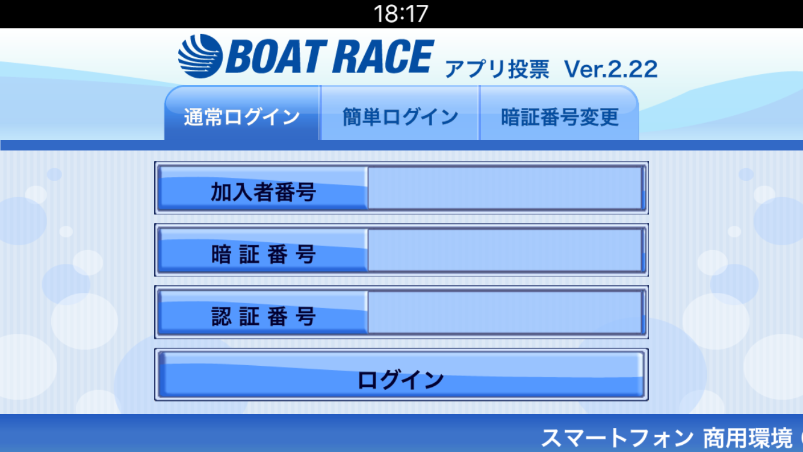
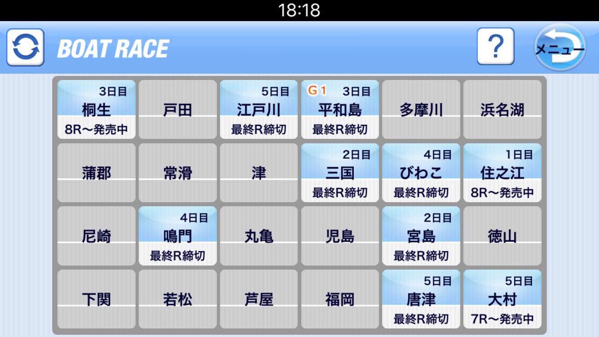
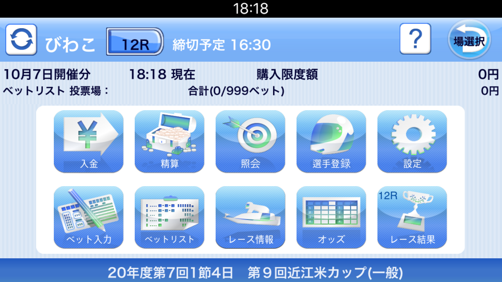
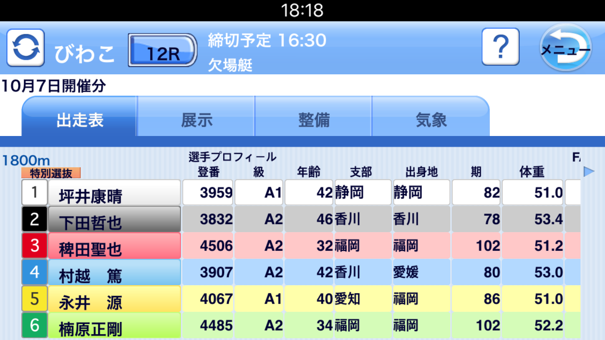
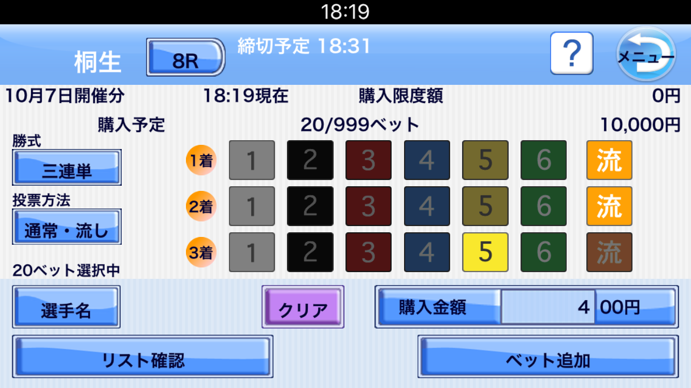
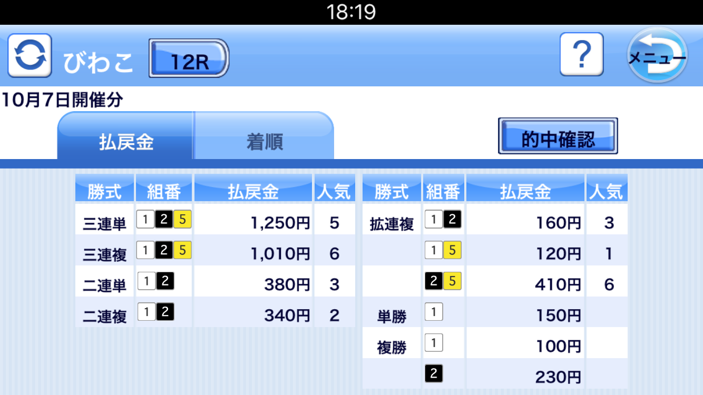

##  모터 보트 경기 iOS어플리케이션 개발Ⅰ
19.07.01 ~ 20.08.31
### 사용한 기술
- ```Objective-C``` , ```x code11``` 
- ```Notifcation``` , ```UserDefault``` 

### 수행한 역할
- storyboard를 이용한 신규 화면 추가 및 디자인 교체 담당
- iOS11의Target버전업에 따른 WkWebView이행 작업
- deprecated메소드 교체 작업
- RESTful API를 이용하여 유저데이터 및 경기 정보 서비스의 통신 개발
- Pusher응용프로그램를 이용한 APNS테스트
- Unit/UI 테스트사양서 작성 및 테스트

### Trouble Shooting
- WkWebView상에서 동영상 풀스크린모드에 푸시알람을 표시   
    + 문제 : WkWebView상에서 동영상 풀스크린모드에 푸시 메세지의 데이터 표시화면으로 전환이 되지 않음   
    + 연구 : 팀원들과 상의 후 해결
    + 해결 : 동영상 풀스크린모드는 새로운 UIWindow를 만들기 때문에 기존의 UIWindow를 찾아 어플리케이션의 keywindow를 makeKeyAndVisible써 변경해줌으로써 동영상 풀스크린 모드를 해제함  

- 스크롤 뷰 화면에서 데이터 중앙으로 표시   
    + 문제 : 각 스크롤 뷰의 화면에서 가운데로 데이터가 제대로 표시되지 않고, 왼쪽으로 치우쳐져 표시됨   
    + 연구 : View의 LiftCycle를 재확인 후에 viewWillLayoutSubviews에서 사이즈 재조정을 하면서 표시된 화면을 보고 사이즈 재조정 문제라고 판단
    + 해결 : viewWillLayoutSubviews의 스크롤 뷰안의 서브뷰들을 사이즈 재조정을 통하여 해결  
     
### Screenshot
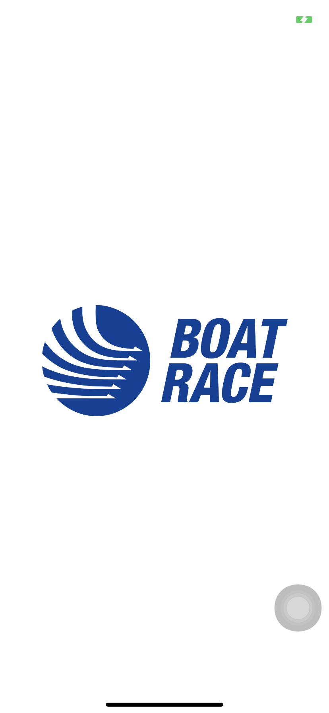
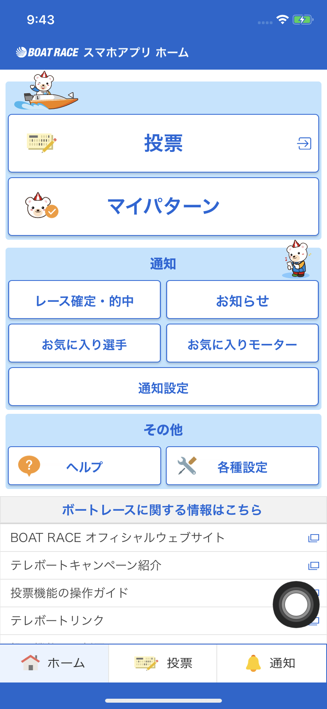
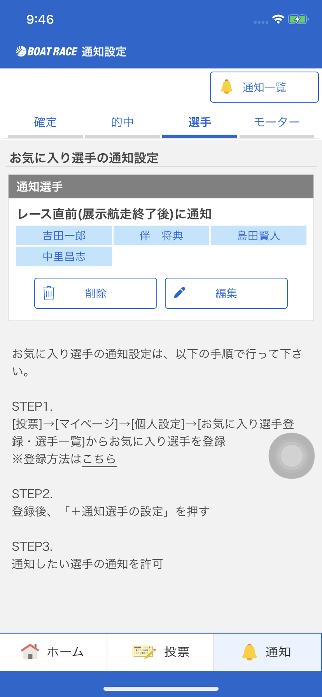
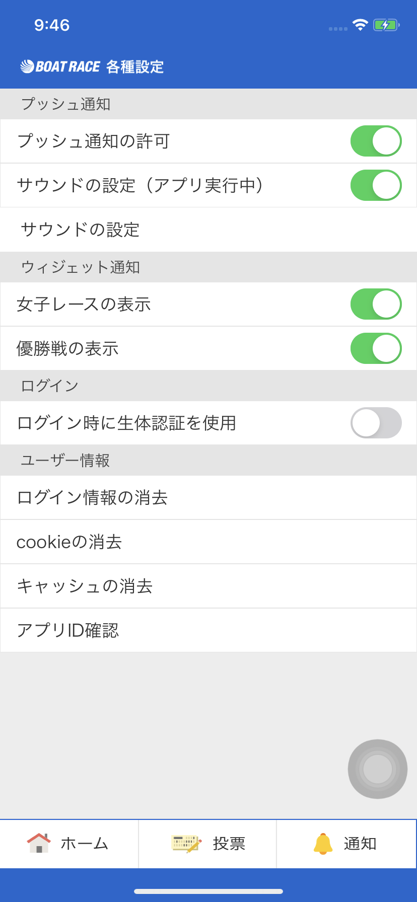
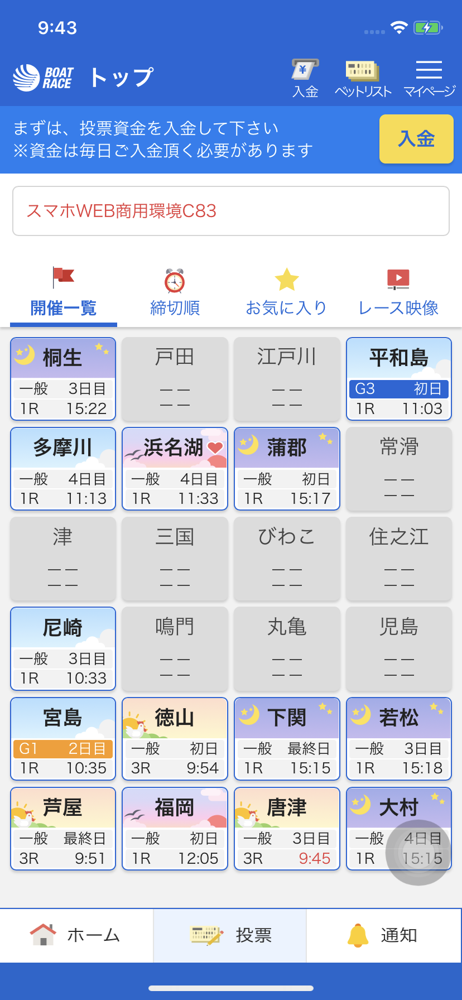

##  MUFG은행 외환 웹사이트 구축
은행의 자체 VBA, Excel 등을 이용한 분석 및 외환 자동 집계를 Web어플리케션을 통해 반자동화 툴을 구축하는 서비스

19.07.1 ~ 20.08.31
### 사용한 기술
- ```Python``` , ```ReactJS``` 
- ```MongoDB``` , ```JIRA``` , ```GitLab``` 

### 수행한 역할
- Hedge Fund파트의 소속에서 환율의 분석 및 데이터 정교화 작업 담당
- Pandas라이브러리를 대용량 데이터를 처리
- 외환 Sales파트의 소속에서 ReactJS를 사용하여 웹서비스 및 API 서버 개발
- Unit/UI 테스트사양서 작성 및 테스트
- Slack과 JIRA를 이용해 정보공유 및 프로젝트 과제관리

