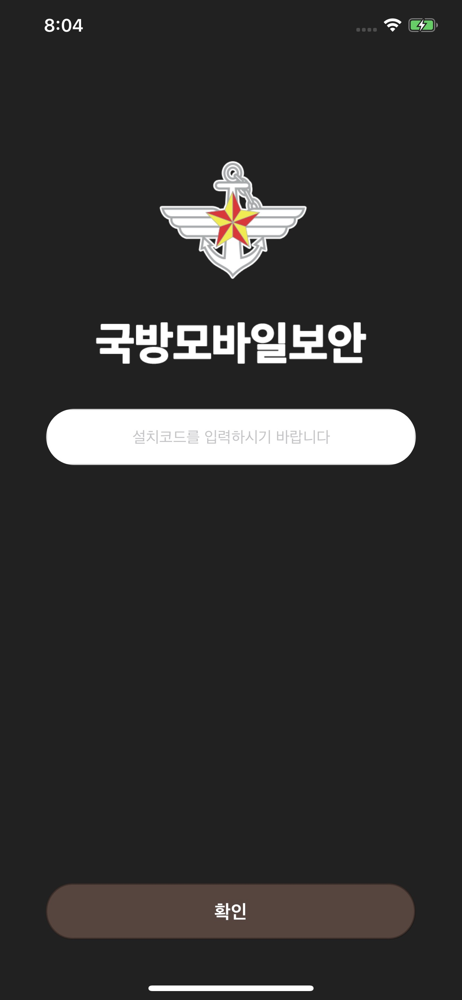
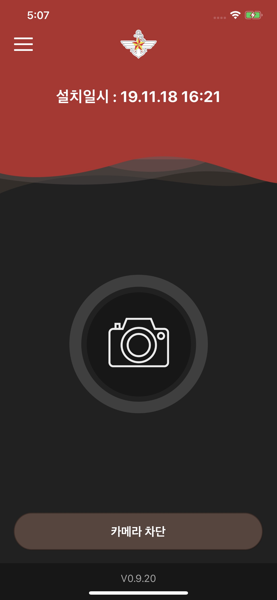

# 경력기술서
안녕하세요. 제가 진행해왔던 프로젝트를 소개하겠습니다.

## 기술스택
- 언어
    - Swift
    - Swift UI
    - Objective-C
    - Python
    - Java
    - C++
- 프레임워크 및 툴
    - X code
    - Pusher
    - ReactJS
    - VS code
    - JIRA
    - GitLab
    - GitButket
    - SourceTree

## 프로젝트【한국】
## 커피하우스
주식이야기를 나누며 사람들과 소통하는 SNS의 기능과 증권사들(SK,KB,NH,신한)의 주식 계좌개설 및 주식 구매, 판매를 할 수 있는 앱입니다.

### 프로젝트 기간
2022.01.17 ~ 2022.11.17

### 사용한 기술
- ```Swift``` , ```Swift-UI``` , ```SOAP API```  , ```REST API``` , ```GitHub```  , ```slack``` 

### 수행한 역할
- storyboard를 이용한 신규 화면 추가 및 디자인 교체
- swift-UI 이용한 팝업 표시
- RESTful API 밎 SOAP API을 통한 테이터 연동
- 기존 timer를 이용한 방식에서 socket i.o를 이용한 주식차트데이터 websocket연동
- Firebase Crashlytics 설정
- AppsFlyer 설정(모바일 마케팅 분석 및 기여 플랫폼)
- 추가 기능개발
    - 파이낸스 UI 및 개발
    - 탐색 탭 UI 교체(랭킹, 추천인 표시)
    - 주식 테마 UI 및 개발
    - 이벤트 화면 UI 및 개발
    - 나를 표현하는 태그 화면 UI 및 개발
- 버그 사항 대응
- NH, KB 증권사 연동
- 앱 심사 및 배포

### Screenshot
<a href="./img/CoffeeHouse/CoffeeHouse_HomeView.jpeg"></a>
<a href="./img/CoffeeHouse/CoffeeHouse_SearchView.jpeg"></a>
<a href="./img/CoffeeHouse/CoffeeHouse_EventListView.jpeg"></a>
<a href="./img/CoffeeHouse/CoffeeHouse_FinanceViewOfMyAccount.jpeg"></a>
<a href="./img/CoffeeHouse/CoffeeHouse_FinanceViewOfInterestStock.jpeg"></a>
<a href="./img/CoffeeHouse/CoffeeHouse_ProfileView.jpeg"></a>
<a href="./img/CoffeeHouse/CoffeeHouse_EditProfileView.jpeg"></a>
<a href="./img/CoffeeHouse/CoffeeHouse_SelectTagView.jpeg"></a>
<a href="./img/CoffeeHouse/CoffeeHouse_ThemeView.jpeg"></a>

## 국방모바일보안
국방모바일보안앱은 군장병 휴대전화의 카메라 기능을 제어하는 앱입니다.
기존 휴대전화 카메라에 부착하는 보안스티커를 대체하는 앱으로, 촬영 등 카메라 기능을 차단하여 군사자료 유출 시도를 원천적으로 차단합니다.

### 프로젝트 기간
2021.06.01 ~ 2021.11.30

### 사용한 기술
- ```Swift``` ,```CoreBluetooth```, ```CoreLocation```, ```CoreNFC```

### 수행한 역할
- 문의사항 대응
- 2차 국방부 사업
    - 간부 식별코드 개선 반영
    - 간부용 신규 비콘 및 NFC 추가
    - GPS해제 기능
    - UI 수정
    - AppStore 심사 및 출시

### Screenshot
<a href="./img/NationalDefenseMobileSecurity/MobileSecurity_enterCode.png"></a>
<a href="./img/NationalDefenseMobileSecurity/MobileSecurity_blockCamera.png"></a>

<br><br><br>

---

<br>

## 프로젝트【일본】
## Batch File작성 웹어플리케이션 구축
엑셀 VBA를 사용하여 이동통신시스템의 기지국 배치에 따른 통신장비의 주파수대역, 대역폭, 변복조기술, 송신 출력, 채널등의 정보를 이용하여 Batch File을 작성하는 시스템을 웹어플리케션을 통해 자동으로 Batch File을 작성해주는 서비스를 구축하는 프로젝트입니다.

### 프로젝트 기간
2020.09.01 ~ 2021.01.31
### 사용한 기술
- ```Java``` ,```Spring Boot``` , ```ReactHook``` 
- ```Postgre``` , ```Postman``` , ```GitButket```

### 수행한 역할
- mockup UI 작성 및 mockup UI 설계서 작성
- 화면 설계서 작성 및 수정
- Meterial-UI프레임워크 적용
- Restful API 정의
- Excel 파일 다운로드 기능
- PostMan을 이용해 API 연동 및 테스트 
- Unit/UI 테스트

## 모터 보트 경기 iOS어플리케이션 개발Ⅰ,Ⅱ
경륜 경마 함께 공영 경기의 하나로서 프로 선수들에 따른 모터 보트 경기에 대한 서비스를 구축하는 프로젝트입니다.

<br>

## 모터 보트 경기 iOS어플리케이션 개발Ⅱ

### 프로젝트 기간
2020.04.01 ~ 2020.08.31
### 사용한 기술
- ```Objective-C``` , ```x code11``` , ```GitButket```

### 수행한 역할
- UI 레이아웃 대응
- UI 설계서 수정
- StatusBar의 시간표시
- Target버전업에 따른 버그 대응
- 버전업일 경우 AppStore로 이동
- Unit/UI 테스트사양서 작성 및 테스트

### Trouble Shooting
- iOS13이후의 기종과 노치가 있는 기종의 가로모드에서의 시간표시
    + 문제 : iOS13이후의 기종과 노치가 있는 기종은 StatusBar가 없기때문에 시간이 표시되지않음   
    + 연구 : 팀원들과 상의 후 해결
    + 해결 : NSTimer을 이용하여 TimeInterval을 1분단위로 하여 시간을 얻어 라벨에 붙여 표시함

- xib파일의 Autolayout 대응을 할 수 없음
    + 문제 : 기존의 xib파일이 모두 4Inch(iPhoneSE 기종)의 기준으로 Autolayout을 사용하지 않고 작성된 파일
    + 연구 : 기존의 xib파일을 Autolayout으로 바꿔보면서 대응이 가능할지 확인한 결과 ,기존의 모든 컴포넌트가 대응되어져 있지 않기 때문에 공수가 오래 걸릴 것이라 판단함
    + 해결 : Transform을 이용하여 4Inch의 비율에 맞춰서 확대함

- TableView에 CALayer로 열 구분선을 넣음
    + 문제 : iOS13부터 TableView에 열을 구분하기 위해 만든 imageView로 인해 데이터가 표시되지 않음   
    + 연구 : imageView의 layer를 지운 결과 , layer.mask에 imageView의 layer가 대응되지 않는다는 것을 확인
    + 해결 : imageView의 layer에서 CALayer로 바꿔 적용시킴으로써 해결

### Screenshot
<a href="./img/BoatRace2/Boatrace2_login.png"></a>
<a href="./img/BoatRace2/Boatrace2_jyo.png"></a>
<a href="./img/BoatRace2/Boatrace2_menu.png"></a>
<a href="./img/BoatRace2/Boatrace2_ranning_table.png"></a>
<a href="./img/BoatRace2/Boatrace2_vote.png"></a>
<a href="./img/BoatRace2/Boatrace2_race_result.png"></a>

<br><br>
##  모터 보트 경기 iOS어플리케이션 개발Ⅰ

### 프로젝트 기간
2019.07.01 ~ 2020.08.31
### 사용한 기술
- ```Objective-C``` , ```x code11``` 
- ```Notifcation``` , ```UserDefault``` 
- ```GitButket```

### 수행한 역할
- storyboard를 이용한 신규 화면 추가 및 디자인 교체 담당
- UI 설계서 및 API 설계서 수정
- iOS11의Target버전업에 따른 WkWebView이행 작업
- deprecated메소드 교체 작업
- RESTful API를 이용하여 유저데이터 및 경기 정보 서비스의 통신 개발
- Pusher응용프로그램를 이용한 APNS테스트
- Unit/UI 테스트사양서 작성 및 테스트

### Trouble Shooting
- WkWebView상에서 동영상 풀스크린모드에 푸시알람을 표시   
    + 문제 : WkWebView상에서 동영상 풀스크린모드에 푸시 메세지의 데이터 표시화면으로 전환이 되지 않음   
    + 연구 : 팀원들과 상의 후 해결
    + 해결 : 동영상 풀스크린모드는 새로운 UIWindow를 만들기 때문에 기존의 UIWindow를 찾아 어플리케이션의 keywindow를 makeKeyAndVisible써 변경해줌으로써 동영상 풀스크린 모드를 해제함  

- 스크롤 뷰 화면에서 데이터 중앙으로 표시   
    + 문제 : 각 스크롤 뷰의 화면에서 가운데로 데이터가 제대로 표시되지 않고, 왼쪽으로 치우쳐져 표시됨   
    + 연구 : View의 LiftCycle를 재확인 후에 viewWillLayoutSubviews에서 사이즈 재조정을 하면서 표시된 화면을 보고 사이즈 재조정 문제라고 판단
    + 해결 : viewWillLayoutSubviews의 스크롤 뷰안의 서브뷰들을 사이즈 재조정을 통하여 해결  

- WkWebView에서의 링크 이동
    + 문제 : WkWebView에서 링크 이동이 안되는 버그 발생 
    + 연구 : WebView팀에서 < a >태그가 아닌 window.open의 자바스크립트를 이용하였다고 하여, 확인한 결과 WKNavigationDelegatee에 트리거가 되자않는다는 것을 확인
    + 해결 : window.open은 WKUIDelegate에 트리거가 되는 것을 확인해 링크의 url을 열리게 함   
     
### Screenshot
<a href="./img/BoatRace/Boatrace_launcher.png"></a>
<a href="./img/BoatRace/Boatrace_home.png"></a>
<a href="./img/BoatRace/Boatrace_favorite_racer.png"></a>
<a href="./img/BoatRace/Boatrace_user_setting.png"></a>
<a href="./img/BoatRace/Boatrace_webview.png"></a>


<br><br>

##  MUFG은행 외환 웹어플리케이션 구축
은행의 자체 VBA, Excel 등을 이용한 분석 및 외환 자동 집계를 Web어플리케션을 통해 반자동화 툴을 제공하는 서비스를 구축하는 프로젝트입니다.

### Screenshot
보안상의 사유로 스크린샷 없음

### 프로젝트 기간
2018.01.01 ~ 2019.06.30
### 사용한 기술
- ```Python``` , ```ReactJS``` 
- ```MongoDB``` , ```JIRA``` , ```GitLab``` 

### 수행한 역할
- Hedge Fund팀
    - Hedge Fund는 고객의 데이터와 환율 데이터를 이용한 거래 분석 및 분석 데이터를 고객의 거래에 적용하여, 거래를 할 때 이윤이 남는 타이밍 및 예상 포인트를 추출하는 프로젝트입니다.
    - 환율의 분석 및 데이터 정교화 작업 담당
    + Front-end
      - Server사이드의 API연동 및 데이터표시
      - Excel 파일 다운로드 기능
      - Ag-grid테이블의 거래 타이밍에 따른 flash 이벤트 효과 
    + Back-end
      - Pandas를 이용해 대량 데이터를 분석 및 처리
      - 거래분석 데이터 결과를 PivotTable 및 Graph의 Excel데이터로 시각화 처리
      - MongoDB를 이용하여 DB에 데이터 추가
    
- 외환 Sales팀
    - 외환 Sales는 FX Connect라는 외환 거래 프로그램과 연동하여, 거래하는 외환을 여러 패턴으로 자동집계 해주며, 은행으로부터 받은 실시간 환율로부터 거래를 해주는 프로젝트입니다.
    + Front-end
      - Ag-grid를 이용해 데이터 테이블 출력
      - Ant-design의 UI컴포넌트를 이용해 디자인 개발
      - Server사이드의 API연동 및 데이터 표시
    + Back-end
      - 자동집계 및 Csv파일 데이터 처리 API 개발
      - Redis의 PUB/SUB를 이용해 실시간 환율 데이터 전송

- Unit/UI 테스트사양서 작성 및 테스트
- Slack과 JIRA를 이용한 정보공유 및 프로젝트 과제관리

